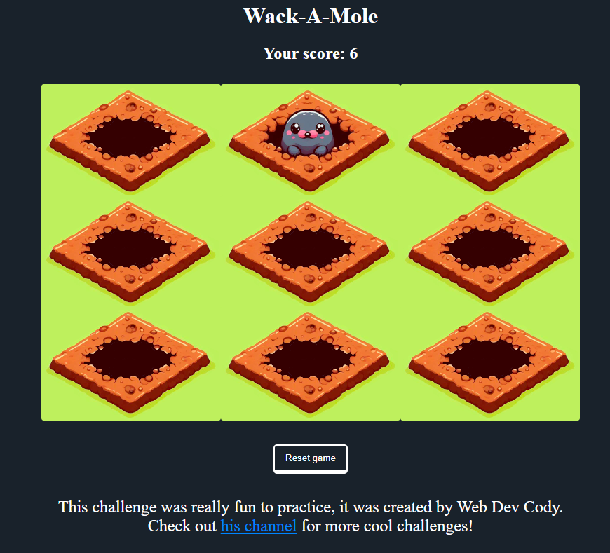

# Wack-A-Mole: React Challenge by Web Dev Cody

This is a begginer level challenge for ReactJS Developer, Even if you already have
experience, it is a lot of fun to create it.

Created with [ViteJS](https://vitejs.dev/) and Typescript.

[Wack-a-mole youtube video](https://www.youtube.com/watch?v=x01eEjSFKig) 
[Web Dev Cody Channel](https://www.youtube.com/@WebDevCody)

## Installation

1. Clone the repository 
git clone https://github.com/AndresAltv/wackamole-challenge.git  

2. Install dependencies 
npm install  

3. Start server 
npm run dev
